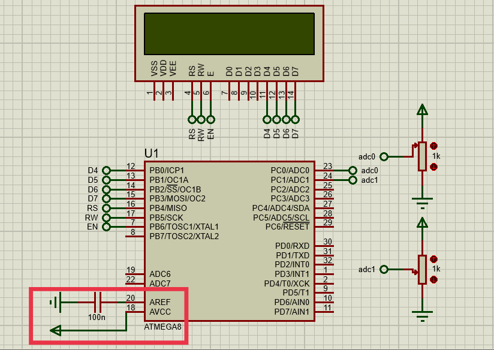

# EXPLANATION
This project contains libraries for programming ATMEGA8A and LCD16x2 4-bit mode ADCs with (c++) language.
# SOFTWARE USED
- Atmel Studio 7 = Code Editor
- Proteus = Circuit Simulation
# HOW TO CREATE AN ATMEL STUDIO PROJECT AND PROTEUS SIMULATION
You can see here https://github.com/Feyfa/LCD16X2_AVR
# THINGS THAT MUST BE CONSIDERED
## IF THESE TWO ARE NOT DONE THEN THE CIRCUIT WILL NOT WORK
- AVCC pin on ATMEGA8A must be connected with VCC
- AREF pin on ATMEGA8A must be connected to a 100nF capacitor
